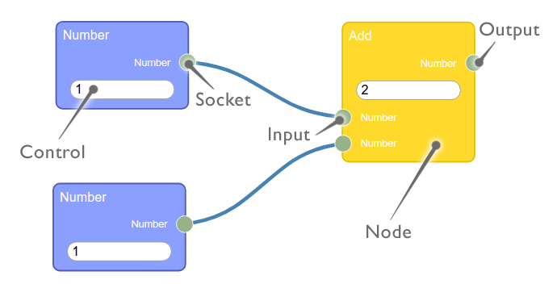

## Installing

You can take latest build in [Releases](https://github.com/retejs/rete/releases). Add it and dependencies to your application.

```html
<script src="https://cdn.jsdelivr.net/npm/rete@1.0.0-alpha.2/build/rete.js"></script>
```
Using the build system, you can install a library from npm
```bash
npm install rete rete-alight-render-plugin rete-connection-plugin
```
Import as follows
```js
import Rete from "rete";
import * as ConnectionPlugin from 'rete-alight-render-plugin';
import * as AlightRenderPlugin from 'rete-connection-plugin';
```
Node.js (optionally, only for processing on the server)
```js
import { Engine, ComponentWorker } from "rete/build/rete.engine";
```

## Getting started



Create needed [Sockets](Sockets.md)
```js
const numSocket = new Rete.Socket('Number value');
```
Define them styles
```css
.socket.number{
    background: #96b38a
}
```

Create [component](Components.md)
```js
class NumComponent extends Rete.Component {
    constructor(){
        super('Number');
    }
    
    builder(node) {
        let out = new Rete.Output('Number',numSocket); 

        node.addOutput(out);
    }

    worker(node, inputs, outputs){
        outputs[0] = node.data.num;
    }
}
```
Initialize a [node editor](Editor.md) aand register component
```html
<div id="rete" class="node-editor"></div>
```
```js
const container = document.querySelector('#rete');
const editor = new Rete.NodeEditor('demo@0.1.0', container);

const numComponent = new NumComponent();
editor.register(numComponent);
```
Use the [Engine](Engine.md) to start processing the data
```js
const engine = new Rete.Engine('demo@0.1.0');
editor.register(numComponent);

editor.on('process nodecreate connection create', async () => {
    await engine.abort();            
    await engine.process(editor.toJSON());            
});
```